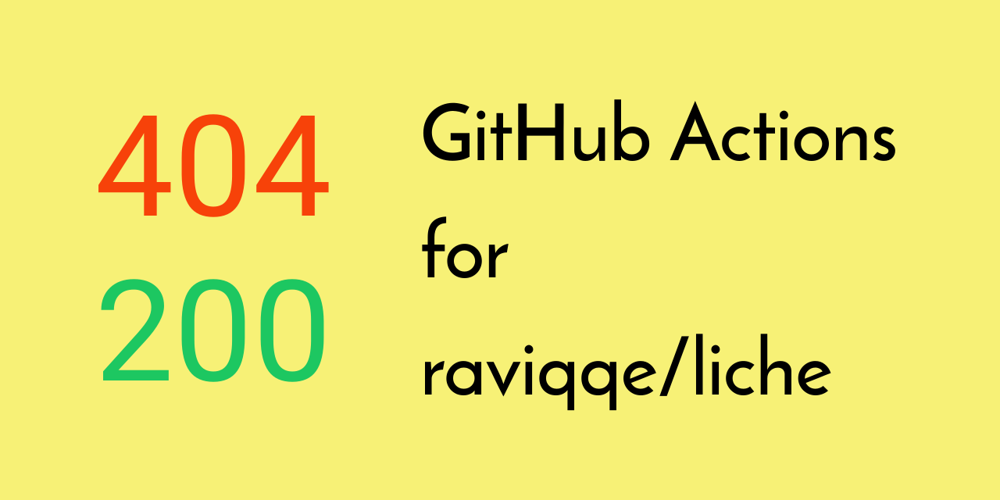

[](https://github.com/peaceiris/actions-liche/blob/master/LICENSE)
[](https://github.com/peaceiris/actions-liche/releases/latest)
[](https://github.com/peaceiris/actions-liche/releases)


## GitHub Actions for liche

- [raviqqe/liche: Fast Link Checker for Markdown and HTML in Go](https://github.com/raviqqe/liche)




## Getting started

### Create `main.workflow`

```sh
workflow "Main workflow" {
  on = "push"
  resolves = ["liche"]
}

action "liche" {
  uses = "peaceiris/actions-liche@v0.1.0"
  args = ["-r", "./content"]
}
```


## License

[MIT License - peaceiris/actions-liche]

[MIT License - peaceiris/actions-liche]: https://github.com/peaceiris/actions-liche/blob/master/LICENSE


## Supprt author

<a href="https://www.patreon.com/peaceiris"></a>
